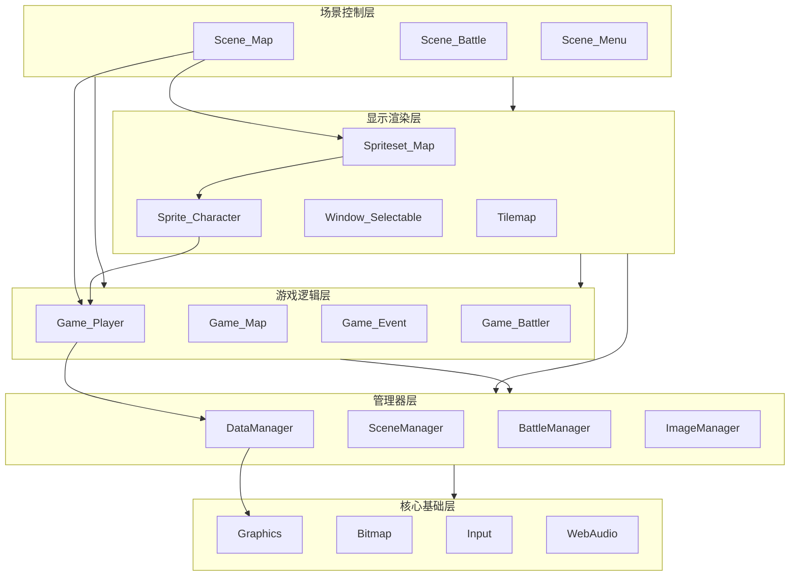

# 核心层次结构详解

## 一、五层架构模型

RPG Maker MV 采用分层架构，从底层到上层依次是：

```
┌─────────────────────────────────────────┐
│           5. 游戏逻辑层                   │
│   Game_Map, Game_Player, Game_Event...  │
├─────────────────────────────────────────┤
│           4. 场景控制层                   │
│   Scene_Map, Scene_Battle, Scene_Menu...│
├─────────────────────────────────────────┤
│           3. 显示渲染层                   │
│   Spriteset, Sprite, Window, Tilemap... │
├─────────────────────────────────────────┤
│           2. 管理器层                     │
│   DataManager, SceneManager, Battle...  │
├─────────────────────────────────────────┤
│           1. 核心基础层                   │
│   Bitmap, Graphics, Input, Audio...     │
└─────────────────────────────────────────┘
```

## 二、各层职责与实现

### 2.1 核心基础层 (Layer 1)

**职责**：提供最基础的图形、音频、输入功能

**核心类**：
```javascript
// 图形核心
Graphics         // 渲染器管理、画面控制
Bitmap           // 图像数据处理、像素操作
Sprite           // PIXI精灵封装
ScreenSprite     // 全屏精灵（色调、闪烁）
TilingSprite     // 平铺精灵（远景图）

// 音频核心
WebAudio         // Web Audio API封装
Html5Audio       // HTML5 Audio封装
AudioManager     // 音频统一接口

// 输入核心
Input            // 键盘输入
TouchInput       // 鼠标/触摸输入

// 工具类
Utils            // 通用工具函数
Decrypter        // 加密资源解密
ResourceHandler  // 资源加载处理
```

**实际代码示例**：
```javascript
// Bitmap 的像素操作实现
Bitmap.prototype.getPixel = function(x, y) {
    if (this._context) {
        var data = this._context.getImageData(x, y, 1, 1).data;
        return 'rgba(' + data[0] + ',' + data[1] + ',' + data[2] + ',' + (data[3] / 255) + ')';
    }
    return 'rgba(0,0,0,0)';
};

// Input 的按键检测实现
Input.isPressed = function(keyName) {
    return !!this._currentState[keyName];
};

Input.isTriggered = function(keyName) {
    return this._latestButton === keyName && this._pressedTime === 0;
};

Input.isRepeated = function(keyName) {
    return (this._latestButton === keyName && 
            (this._pressedTime === 0 || 
             (this._pressedTime >= this.keyRepeatWait && 
              this._pressedTime % this.keyRepeatInterval === 0)));
};
```

### 2.2 管理器层 (Layer 2)

**职责**：协调资源、管理全局状态、处理系统逻辑

**核心类**：
```javascript
// 数据管理
DataManager      // 数据库加载、存档读档

// 场景管理
SceneManager     // 游戏循环、场景切换

// 战斗管理
BattleManager    // 战斗流程、回合处理

// 资源管理
ImageManager     // 图像加载、缓存
AudioManager     // 音频播放控制

// 系统管理
ConfigManager    // 用户配置
StorageManager   // 数据持久化
PluginManager    // 插件加载管理
```

**管理器间协作流程**：
```javascript
// 游戏启动流程展示管理器协作
SceneManager.run(Scene_Boot)
    │
    ├─→ DataManager.loadDatabase()         // 加载JSON数据
    │       └─→ ImageManager.isReady()     // 检测图像加载
    │
    ├─→ ConfigManager.load()               // 加载用户配置
    │       └─→ StorageManager.load(-1)    // 从存储读取
    │
    ├─→ PluginManager.setup($plugins)      // 初始化插件
    │
    └─→ SceneManager.goto(Scene_Title)     // 进入标题场景
```

### 2.3 显示渲染层 (Layer 3)

**职责**：将游戏对象渲染到屏幕，处理视觉效果

**核心类**：
```javascript
// 精灵系统
Sprite_Base          // 基础精灵
Sprite_Character     // 角色精灵
Sprite_Battler       // 战斗者精灵
Sprite_Actor         // 角色战斗精灵
Sprite_Enemy         // 敌人精灵
Sprite_Animation     // 动画精灵
Sprite_Picture       // 图片精灵
Sprite_Timer         // 计时器精灵

// 精灵集
Spriteset_Base       // 精灵集基类
Spriteset_Map        // 地图精灵集
Spriteset_Battle     // 战斗精灵集

// 地图渲染
Tilemap              // 瓦片地图（Canvas）
ShaderTilemap        // 瓦片地图（WebGL）
TilemapLayer         // 瓦片图层

// 窗口系统
Window               // 窗口容器
Window_Base          // 窗口基类
Window_Selectable    // 可选择窗口
Window_Command       // 命令窗口
// ... 20+ 窗口类
```

**渲染流程实现**：
```javascript
// Scene_Map 的渲染创建
Scene_Map.prototype.createDisplayObjects = function() {
    // 1. 创建精灵集（包含所有视觉元素）
    this.createSpriteset();
    
    // 2. 创建窗口层（UI元素）
    this.createWindowLayer();
    
    // 3. 创建消息窗口（最重要的UI）
    this.createMessageWindow();
};

// Spriteset_Map 的详细创建
Spriteset_Map.prototype.createLowerLayer = function() {
    // 背景层（菜单背景）
    this.createBackground();
    
    // 远景图
    this.createParallax();
    
    // 瓦片地图
    this.createTilemap();
    
    // 角色精灵
    this.createCharacters();
    
    // 特效
    this.createShadow();
    this.createDestination();
    this.createWeather();
};

// 每帧渲染更新
Spriteset_Map.prototype.update = function() {
    this.updateTileset();
    this.updateParallax();
    this.updateTilemap();
    this.updateCharacters();
    this.updateWeather();
    this.updatePictures();
};
```

### 2.4 场景控制层 (Layer 4)

**职责**：游戏流程控制、玩家交互处理、场景切换

**核心类**：
```javascript
// 基础场景
Scene_Base           // 场景基类

// 系统场景
Scene_Boot           // 启动场景
Scene_Title          // 标题画面
Scene_Gameover       // 游戏结束
Scene_Debug          // 调试场景

// 游戏场景
Scene_Map            // 地图场景
Scene_Battle         // 战斗场景

// 菜单场景
Scene_Menu           // 主菜单
Scene_Item           // 物品画面
Scene_Skill          // 技能画面
Scene_Equip          // 装备画面
Scene_Status         // 状态画面
Scene_Options        // 选项画面
Scene_Save           // 存档画面
Scene_Load           // 读档画面
Scene_Shop           // 商店画面
Scene_Name           // 名字输入
```

**场景生命周期实现**：
```javascript
// Scene_Base 定义的生命周期方法
Scene_Base.prototype.create = function() {
    // 创建场景资源（精灵、窗口等）
};

Scene_Base.prototype.start = function() {
    // 场景开始逻辑（资源加载完成后）
};

Scene_Base.prototype.update = function() {
    // 每帧更新逻辑
};

Scene_Base.prototype.stop = function() {
    // 场景停止（准备切换）
};

Scene_Base.prototype.terminate = function() {
    // 场景终止（释放资源）
};

Scene_Base.prototype.isBusy = function() {
    // 场景是否忙碌（阻止切换）
    return this._messageWindow && this._messageWindow.isClosing();
};

Scene_Base.prototype.isReady = function() {
    // 场景是否就绪（资源加载完成）
    return this._actorCommandWindow ? this._actorCommandWindow.isReady() : true;
};
```

### 2.5 游戏逻辑层 (Layer 5)

**职责**：核心游戏玩法逻辑、状态管理、数据模型

**核心类**：
```javascript
// 基础类
Game_BattlerBase     // 战斗者基类
Game_Battler         // 战斗者
Game_Actor           // 角色
Game_Enemy           // 敌人

// 地图相关
Game_Map             // 地图数据
Game_CharacterBase   // 角色基类
Game_Character       // 可移动角色
Game_Player          // 玩家
Game_Event           // 事件
Game_Followers       // 跟随者
Game_Vehicle         // 交通工具

// 队伍相关
Game_Party           // 队伍
Game_Troop           // 敌群
Game_Actors          // 角色管理器

// 状态系统
Game_Switches        // 开关
Game_Variables       // 变量
Game_SelfSwitches    // 独立开关

// 其他
Game_System          // 系统设置
Game_Screen          // 画面效果
Game_Picture         // 图片
Game_Timer           // 计时器
Game_Message         // 消息
Game_Temp            // 临时数据
Game_Action          // 战斗行动
Game_Interpreter     // 事件解释器
```

**游戏对象交互实现**：
```javascript
// Game_Player 输入处理到事件触发的完整流程
Game_Player.prototype.update = function(sceneActive) {
    if (sceneActive) {
        this.updateInput();  // 处理玩家输入
    }
    this.updateFollowers();  // 更新跟随者
};

Game_Player.prototype.updateInput = function() {
    if (!this.isMoving()) {
        var direction = this.getInputDirection();
        if (direction > 0) {
            this.executeMove(direction);
            this.updateEncounterCount();
        }
    }
};

Game_Player.prototype.executeMove = function(direction) {
    this.moveStraight(direction);
};

// 移动时检测碰撞和事件
Game_Character.prototype.moveStraight = function(d) {
    if (this.canPass(this.x, this.y, d)) {
        this.setDirection(d);
        this._x = $gameMap.roundXWithDirection(this.x, d);
        this._y = $gameMap.roundYWithDirection(this.y, d);
        this._stepCount++;
        this.checkEventTriggerTouchFront(d);  // 检测接触事件
    }
};
```

## 三、层间通信模式

### 3.1 自上而下的调用

```javascript
// 场景层 → 显示层
Scene_Map.prototype.createSpriteset = function() {
    this._spriteset = new Spriteset_Map();  // 创建显示对象
    this.addChild(this._spriteset);
};

// 显示层 → 游戏逻辑层
Sprite_Character.prototype.updatePosition = function() {
    this.x = this._character.screenX();  // 读取游戏对象状态
    this.y = this._character.screenY();
};

// 游戏逻辑层 → 管理器层
Game_Map.prototype.setup = function(mapId) {
    this._mapId = mapId;
    this._tilesetId = $dataMap.tilesetId;  // 访问数据
};
```

### 3.2 自下而上的通知

```javascript
// 显示层 → 场景层（通过事件）
Sprite_Character.prototype.update = function() {
    if (this._character.isAnimationPlaying()) {
        this.setupAnimation();
        // 动画完成后通知场景
    }
};

// 游戏逻辑层 → 场景层（通过状态标记）
Game_Player.prototype.reserveTransfer = function(mapId, x, y) {
    this._transferring = true;  // 设置标记
    // Scene_Map 会检测此标记并触发场景切换
};

// Scene_Map 检测传送
Scene_Map.prototype.updateTransferPlayer = function() {
    if ($gamePlayer.isTransferring()) {
        this.fadeOutForTransfer();
        $gamePlayer.performTransfer();
        DataManager.loadMapData($gameMap.mapId());
    }
};
```

### 3.3 管理器作为中介

```javascript
// 场景切换通过 SceneManager
SceneManager.push(Scene_Menu);
SceneManager.pop();

// 数据加载通过 DataManager
DataManager.loadDatabase();
DataManager.loadMapData(mapId);

// 资源加载通过 ImageManager
ImageManager.loadCharacter('Actor1');
```

## 四、实际案例分析

### 案例1：玩家移动的完整流程

```javascript
// 1. 输入层检测按键
Input.update();  // 更新输入状态
if (Input.isPressed('down')) {
    // 2. 场景层接收输入
    Scene_Map.prototype.updateMain() → 
        $gamePlayer.update(sceneActive);
    
    // 3. 游戏逻辑层处理移动
    Game_Player.prototype.updateInput() →
        this.executeMove(2) →
            this.moveStraight(2) →
                if (this.canPass(x, y, 2)) {
                    // 4. 计算新位置
                    this._x = x;
                    this._y = y + 1;
                    
                    // 5. 检测事件
                    this.checkEventTriggerTouchFront(2);
                }
}

// 6. 显示层更新位置
Sprite_Character.prototype.updatePosition = function() {
    this.x = this._character._realX * 48;
    this.y = this._character._realY * 48;
};

// 7. 渲染到屏幕
SceneManager.renderScene() →
    Graphics.render(Scene_Map);
```

### 案例2：菜单打开的完整流程

```javascript
// 1. 输入检测
Input.isTriggered('menu')  // ESC键按下

// 2. 场景响应
Scene_Map.prototype.updateScene() →
    if (this.isMenuCalled()) {
        this.callMenu();
    }

// 3. 调用菜单
Scene_Map.prototype.callMenu = function() {
    // 保存当前状态
    $gameTemp.clearDestination();
    
    // 播放音效
    SoundManager.playOk();
    
    // 4. 场景切换（通过管理器）
    SceneManager.push(Scene_Menu);
};

// 5. 创建菜单场景
Scene_Menu.prototype.create = function() {
    this.createCommandWindow();  // 命令窗口
    this.createGoldWindow();     // 金币窗口
    this.createStatusWindow();   // 状态窗口
};

// 6. 渲染菜单
SceneManager.renderScene() →
    Graphics.render(Scene_Menu);
```

### 案例3：战斗开始的完整流程

```javascript
// 1. 遭遇检测
Scene_Map.prototype.updateEncounter = function() {
    if ($gamePlayer.canEncounter()) {
        var encounter = $gameMap.makeEncounterTroopId();
        if (encounter) {
            // 2. 初始化战斗
            BattleManager.setup(encounter, false, false);
            
            // 3. 保存快照
            SceneManager.snapForBackground();
            
            // 4. 场景切换
            SceneManager.push(Scene_Battle);
        }
    }
};

// 5. 战斗初始化
BattleManager.setup = function(troopId, canEscape, canLose) {
    this.initMembers();
    $gameTroop.setup(troopId);  // 创建敌人
    this._canEscape = canEscape;
    this._canLose = canLose;
    this._phase = 'init';
};

// 6. 战斗场景创建
Scene_Battle.prototype.create = function() {
    this.createSpriteset();      // 战斗精灵
    this.createAllWindows();     // 战斗窗口
};

// 7. 战斗循环
BattleManager.update() →
    switch(this._phase) {
        case 'input':  // 玩家输入
        case 'turn':   // 回合执行
        case 'action': // 行动执行
        case 'end':    // 战斗结束
    }
```

## 五、层间依赖关系图



这个分层架构确保了：
1. **关注点分离**：每层只关注自己的职责
2. **松耦合**：层间通过接口通信，降低依赖
3. **可测试性**：每层可以独立测试
4. **可扩展性**：插件可以覆盖任意层的方法
